<div align="center">


**Regulatory lookback and decision replay for AML — built on Snowflake Cortex and CoCo CLI**

When a transaction-monitoring threshold turns out to have been wrong, the activity it missed
raised no alert — so there is no file to re-read and nothing to sample.
TRACE replays every transaction against the corrected rule and adjudicates what sampling cannot reach.

*Snowflake CoCo CLI Hackathon 2026 — GCC Edition · Challenge 1: Risk, Fraud and Regulatory Intelligence Copilot*

</div>

---

### Start here

| | |
|---|---|
| 🎯 **The problem, in 90 seconds** | [The gap](#the-gap) |
| 📊 **Results and honest limits** | [`EVALUATION.md`](EVALUATION.md) — what was measured, and what it does not show |
| 🏗 **Architecture diagrams** | [`docs/architecture.md`](docs/architecture.md) |
| 🧪 **Raw output of every run** | [`eval/`](eval/) — nothing in this repo is quoted from memory |
| 🤖 **CoCo skills, subagents, hook** | [`.cortex/`](.cortex/) |
| ▶️ **Run it yourself** | [Reproduce](#reproduce) — Windows, macOS, Linux |
| 🔍 **The single best artifact** | [One case, end to end](#one-case-end-to-end) |

**Headline:** 2,759 customer-weeks and ₹247 crore raised no alert for thirteen months.
TRACE recovered **1,131 of the 1,331 genuinely suspicious weeks** (recall 0.850) for about **$15**,
and issued **687 hash-chained evidence packs** an examiner can verify rather than trust.

---

## The gap

A bank raises its structuring threshold from ₹8,00,000 to ₹10,00,000 as an alert-efficiency
measure. Thirteen months later a supervisor observes the calibration was wrong, and it is reverted.

Everything in the ₹8L–₹10L band during those thirteen months **generated no alert, no disposition
and no case file.**

This matters because of how threshold validation actually works. Above-the-line / below-the-line
testing — the industry workhorse, expected under FFIEC-style model-validation guidance and staffed
heavily out of Indian GCCs — proceeds by **sampling a few hundred below-the-line alerts** and
extrapolating. It is only as good as the dispositions it samples.

When the gap produced no alerts at all, there is nothing in the sample frame.
**The method cannot see the problem it exists to find.**

---

## What it does

Deterministic SQL scans all 607,307 transactions and reconstructs, for every customer-week, the
evidence a reviewer *would* have seen. Cortex then adjudicates each one — inside Snowflake, next to
the data.

| | |
|---|---|
| Weeks adjudicated | **2,759** · zero parse failures |
| Genuinely suspicious | 1,331 |
| **Recovered at the review threshold** | **1,131 — recall 0.850** |
| Precision | 0.593 |
| AUC on this population | 0.608 |
| Cost of the full lookback | ~**$15** |

Output is a ranked triage, never a verdict:

| band | weeks | notional | actually suspicious | hit rate |
|---|---|---|---|---|
| **ESCALATE** ≥ 0.60 | 687 | ₹61.4 Cr | 546 | **79.5%** |
| REVIEW 0.45–0.60 | 1,223 | ₹109.4 Cr | 586 | 47.9% |
| DEPRIORITISE < 0.45 | 849 | ₹76.1 Cr | 199 | 23.4% |

**Work the top 25% of the queue, recover 41% of the laundering.** Top-decile hit rate is 0.889
against a base rate of 0.482.

The lowest band is *deprioritise*, never *clear* — it still holds 199 genuinely suspicious weeks.

---

## Architecture

```mermaid
flowchart LR
    A["Policy prose"] -->|"model reads"| B["Candidate predicate"]
    B -->|"human signs,<br/>bound to text hash"| C["Certified rule"]
    C -->|"SQL only"| D["Alert / no alert"]
    D --> E["Candidate population"]
    E -->|"model scores"| F["Probability"]
    F -->|"human-chosen<br/>threshold"| G["Triage band"]
    G --> H["Evidence pack<br/>hash-chained"]

    style B fill:#fff4d6,stroke:#a06800
    style F fill:#fff4d6,stroke:#a06800
    style D fill:#d7f5dd,stroke:#1a7f37
    style G fill:#d7f5dd,stroke:#1a7f37
    style H fill:#ddf4ff,stroke:#0969da
```



Amber is probabilistic. Green is deterministic. **The model never decides an outcome** — it reads
prose and it scores evidence. Everything between is SQL a regulator can re-derive, or a human
signature. Full diagrams, including the data model and the three control layers, are in
[`docs/architecture.md`](docs/architecture.md).

**Bitemporal by construction.** *Event time* (when something happened) and *knowledge time* (when
we learned it) stay strictly separate. Policy versions carry validity intervals and are immutable —
a changed threshold inserts a new row, because updating in place relabels history. Time Travel is
deliberately unused: retention caps at 90 days and a lookback spans years.

**Evidence is frozen, never recomputed.** Rebuilding it later would import knowledge the reviewer
did not have — late data, corrections, a KYC refresh filed afterwards. That is precisely the flaw
an examiner probes.

**Rolling features exclude the current row** (`ROWS BETWEEN 26 PRECEDING AND 1 PRECEDING`). Letting
the current week into its own history is how a replay flatters itself.

---

## One case, end to end

The clearest artifact in the project. From an evidence pack for a week nobody ever looked at:

> **Why no alert was raised.** Aggregate cash of INR 941,871 fell below the threshold of
> INR 1,000,000 in force under PV-TM-STRUCT-002, so no alert was generated and no disposition
> exists. Under PV-TM-STRUCT-003 (threshold INR 800,000) the same activity would alert.

> **Strongest factor pointing to laundering.** Cash volume is 20.89× declared monthly income for a
> Government Employee — an occupation with fixed, traceable salary payments. INR 941,871 appeared
> across 7 deposits in one week after 26 consecutive weeks of zero cash activity, with 85.7% of
> deposits sitting just below round numbers.

> **Strongest innocent explanation.** LOW internal risk rating and a long-established relationship;
> possibly an undeclared side business producing a one-time cash windfall — though that would
> require the business to be entirely unregistered and the income grossly under-declared.

Each pack also carries the rule then and now with citations, the point-in-time evidence,
provenance, and a hash chained to the preceding pack.

---

## Why this has to live in Snowflake

Exhaustive replay means reconstructing evidence across the full transaction record and adjudicating
every candidate. Shipping 607,307 transactions and thousands of narrative adjudications to an
external model API is a data-residency problem, a compliance problem and an economic one.

Cortex runs the model **next to the data**, under the account's existing RBAC and masking policies.
Nothing leaves. **The compute model is not an implementation detail here — it is what makes the
method possible.**

> **On hosting.** TRACE is deliberately *not* deployed to Vercel or any external host. Every page
> queries `TRACE_DB`; there is no data, no compute and no model outside the account. Hosting a copy
> elsewhere would mean either publishing Snowflake credentials or faking the data — and it would
> contradict the one claim the architecture rests on. The app runs as Streamlit in Snowflake, which
> is the only place it can honestly run.

### CoCo CLI as the control plane

Four skills and two subagents in [`.cortex/`](.cortex/) encode what the build learned:

| skill | what it prevents |
|---|---|
| `trace-conventions` | Dialect traps that each cost a failed run — no named `WINDOW` clause, `POLICY_AS_OF` unusable per-row, `AI_COMPLETE` returning an OBJECT rather than a string |
| `run-lookback` | Spending $25 to test a prompt. States cost before running; enforces stage order and the gates that stop a run |
| `verify-chain` | Reporting a partial failure as "mostly fine", or an empty chain as `INTACT` |
| `explain-case` | Quoting only the incriminating half of an adjudication, or stating a model probability as a finding of fact |

Subagents are read-only by construction: `case-investigator` cannot query `EVAL` or write to
`AUDIT`; `chain-auditor` verifies and is instructed not to repair, because a chain rebuilt over
altered packs is internally consistent and evidentially worthless.

A `PreToolUse` hook refuses every mutating statement against `AUDIT.*` — **no carve-out for our own
code**, which is why the hash chain had to become append-only first. The test suite found a real
bypass in that hook on its first run.

---

## Reproduce

Works on **Windows, macOS and Linux**. The only platform-specific step is installing CoCo CLI.

### Prerequisites

- **Snowflake Enterprise** (for masking and row-access policies) in a region with Cortex model
  availability — developed on `AWS_US_WEST_2`
- **Python 3.11+**
- [`uv`](https://docs.astral.sh/uv/) — optional, but every command below assumes it

### 1 · Install CoCo CLI

**macOS / Linux / WSL**

```bash
curl -LsS https://ai.snowflake.com/static/cc-scripts/install.sh | sh
```

**Windows (PowerShell)**

```powershell
irm https://ai.snowflake.com/static/cc-scripts/install.ps1 | iex
```

Then launch it **from the repository root**, so `.cortex/` skills, subagents and the guard are
loaded:

```bash
cortex
```

### 2 · Generate the corpus

Deterministic and seeded. Entirely local — no Snowflake needed for this step.

```bash
uv run --with numpy --with pandas generator/generate.py --scale slice
```

### 3 · Run the SQL, in order

Through CoCo, Snowsight, or any Snowflake client. `PUT` paths are relative to the repository root,
so they work unchanged on every platform.

| script | what it does | AI cost |
|---|---|---|
| `sql/01_foundation.sql` | bitemporal schema — **destructive** | — |
| `sql/02_eval_tables.sql` | ground-truth tables, isolated from every agent role | — |
| `sql/11_reload_and_score_v5.sql` | stage and load the corpus | — |
| `sql/12_replay_engine.sql` | point-in-time features + **validation gate** | — |
| `sql/13_adjudicate.sql` | recalibration, then full adjudication | **~$15–25** |
| `sql/14_evidence_packs.sql` | evidence packs | — |
| `sql/16_append_only_chain.sql` | hash chain | — |
| `sql/18_counterfactual_replay.sql` | replay any threshold, any window | — |
| `sql/19_semantic_view_and_agent.sql` | semantic view, policy corpus, Cortex Agent | pennies |
| `sql/22_extraction_staged.sql` | predicate compiler | pennies |
| `sql/23_certification_gate.sql` | certification, and lapse on amendment | — |
| `sql/26_action_log_rebuild.sql` | append-only case actions, chained | — |
| `sql/27_tamper_drill.sql` | three tamper drills — proves the detector fires | — |
| `sql/15_final_metrics.sql` | AUC, lift curve, branch concentration | — |

`sql/17_roles_and_masking.sql`, `sql/26_action_log_rebuild.sql` and `sql/27_tamper_drill.sql` are
run **by a human in Snowsight** — they create objects in `AUDIT`, which this project's own controls
refuse from the agent. That is the point rather than a defect.

`sql/03`–`10`, `21`, `24` and `25` are superseded and kept as history: two failed corpus designs, a
measurement error, a debugging session, and an action log whose hash chain reported `TAMPERED` on
its own data — correctly. See
[the write-up](EVALUATION.md#the-action-log-reported-tampered-on-its-own-data-and-was-right).
That history is part of the argument.

### 4 · The app

Snowsight → **Projects → Streamlit → + Streamlit App**, then paste
[`app/trace_app.py`](app/trace_app.py). Seven pages: the gap, an interactive threshold replay, the
queue, an evidence pack, where the rule came from, chain integrity, and the evaluation.

### 5 · Tests

```bash
uv run --with pytest --with numpy --with pandas pytest -q
```

Covers the guard's behaviour and the corpus invariants the evaluation depends on — seed
determinism, exactly one policy version per date, alerts firing against the threshold of their own
time, and no ground truth leaking into features.

---

## Layout

```
app/trace_app.py                Streamlit in Snowflake — the investigator surface
generator/generate.py           synthetic corpus (seeded, deterministic)
generator/load.py               optional Python loader
sql/01-02                       bitemporal schema, ground-truth tables
sql/11-16                       load, replay engine, adjudication, packs, chain, metrics
sql/17                          roles, masking, isolation tests (Snowsight, by a human)
sql/18                          counterfactual replay: any threshold, any window
sql/19                          semantic view, policy corpus, Cortex Agent
sql/20-23, 26                   predicate compiler, certification gate, case action log
sql/27                          tamper drills against the action log (Snowsight, by a human)
sql/03-10, 21, 24-25            superseded; retained as history
.cortex/skills/                 four CoCo skills
.cortex/agents/                 two read-only subagents
.cortex/hooks/                  PreToolUse guard on the AUDIT schema
tests/                          guard behaviour and corpus invariants
eval/                           raw output of every run
docs/architecture.md            data model, model boundary, control layers
EVALUATION.md                   what was measured, and what it does not show
```

---

## Honest limitations

Stated here rather than buried. [`EVALUATION.md`](EVALUATION.md) is the full account.

- **AUC is 0.608** on the invisible population (0.541 on alerts) against an oracle ceiling of
  0.868. Real signal in the record is not being extracted.
- **The model does not beat human reviewers head-to-head.** On alerts that *did* fire it trades
  precision for recall and wins on neither at a single threshold. Its value is reaching a
  population no analyst reviewed — where the baseline is not a human, it is zero.
- **Clean skins are not detected, by design.** ~20% of mules behave exactly like legitimate
  businesses; they are irreducible, and the model correctly scores them as ambiguous rather than
  resolving them.
- **The corpus is enriched** — 31.7% of alerts are truly suspicious versus roughly 2% in
  production. Absolute rates are inflated; the ranking metrics are not.
- **Data is fully synthetic.** "Accuracy vs truth" is only computable because ground truth is
  generated. In production only agreement with human dispositions would be available.
- **Not built:** a CI regression gate via `cortex exec` — headless tool allowlisting is unresolved.

---

<div align="center">

*Synthetic data only. No real customer, transaction or institutional data appears anywhere in this
repository.*

[MIT](LICENSE)

</div>
