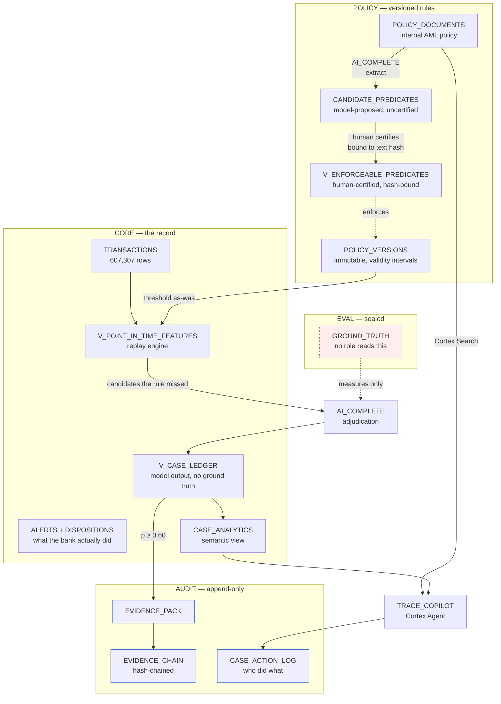
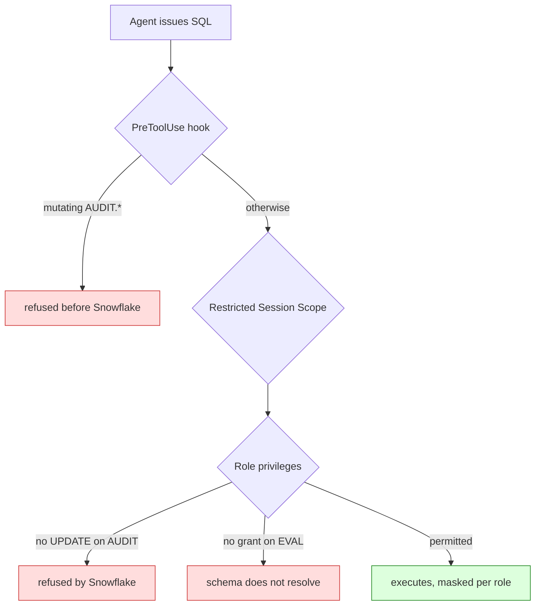

# Architecture

## The pipeline

## Where the model is, and is not

```mermaid
flowchart LR
    A["Policy prose"] -->|"model reads"| B["Candidate predicate"]
    B -->|"human signs"| C["Certified rule"]
    C -->|"SQL only"| D["Alert / no alert<br/>deterministic"]
    D --> E["Candidate population"]
    E -->|"model scores"| F["Probability"]
    F -->|"human-chosen threshold"| G["Triage band"]
    G --> H["Evidence pack"]

    style B fill:#ffd,stroke:#a80
    style F fill:#ffd,stroke:#a80
    style D fill:#dfd,stroke:#282
    style G fill:#dfd,stroke:#282
```

Amber is probabilistic. Green is deterministic. **The model never decides an
outcome** — it reads prose and it scores evidence. Every gate between those two
steps is SQL a regulator can re-derive, or a human signature.

## Controls

Three independent layers. The hook is client-side and covers only the agent's
SQL tool; the role privileges are the real control and hold regardless of what
connects. Each was verified by attempting the thing it forbids — see
[`EVALUATION.md`](../EVALUATION.md) §8.
